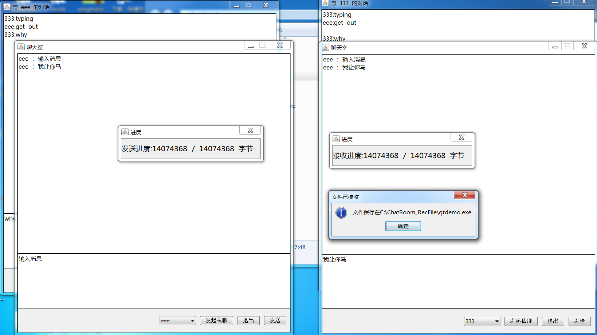
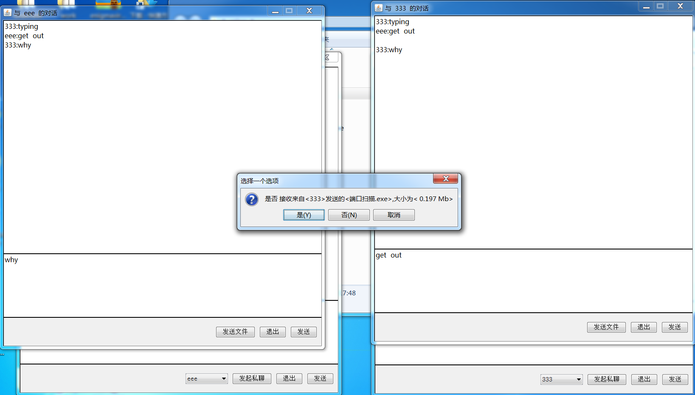

## 启动/Start

> src/selectroom/ui/SelectRoomUI.java

## 问题/Question

> 消息接收处理的代码不够优雅,不想改了，我嫌麻烦
>
> src/domain/SocketThread_>run_
>
> src/domain/ClientThread_>run

### 项目名/ProjectName

> 感谢 google 机翻
> 
> Thanks Google Translate

